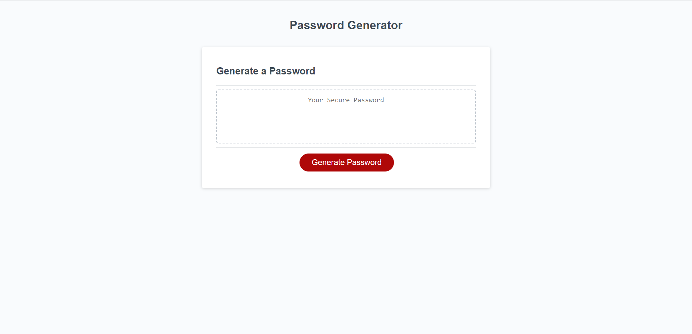

# Description
This is a password generator for generatoring unique passwords that fit a specific criteria
# What was the motivation?
I wanted to be able for build a password generator using JavaScript
# Why did I build it?
I wanted to learn more about how generators can work and get the experience of building one myself
# What problem does it solve?
I can use this to solve the issue of having unique passwords that meet certain criteria
# What did you learn?
I learned how to use functions to duplicate code. I learned why DRY code is so important.
# Screenshot

# Website URL
